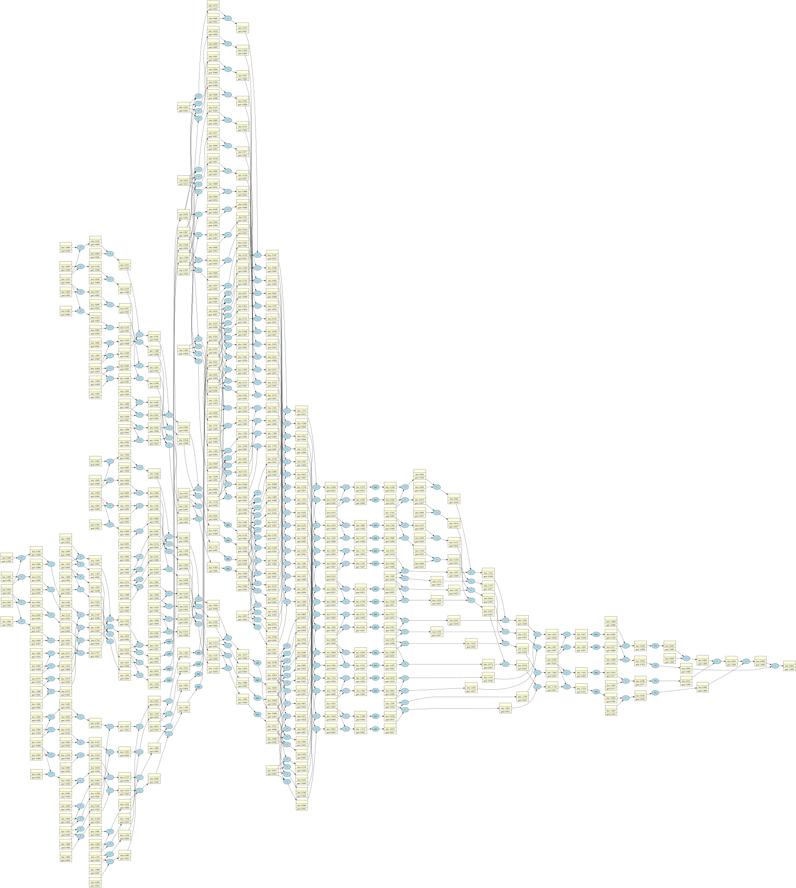

# NeuroLite ⚡

A basic & lightweight neural network, built from scratch. **NeuroLite** extends the ideas from `micrograd`, A tiny Autograd engine by [Karpathy](https://github.com/karpathy),
implementing a small but functional Multi-Layer Perceptron (MLP) with automatic differentiation and visualization tools. It serves as a minimal yet powerful educational tool
for understanding backpropagation and neural network training. 🤖

---


---

### Features 🌟

- A custom-built **micrograd engine** similar to PyTorch's `autograd`. 🔧
- A fully functional **MLP (MultiLayer Perceptron)** implementation. 🧠
- **Graph visualization** of the computation graph using [GraphViz](https://graphviz.org/). 📊
- **Gradient-based optimization** via backpropagation. 💥

---

### Training a neural net 🏋️‍♂️

The notebook `mlp.ipynb` provides a full demonstration of training a **3-layer Multi-Layer Perceptron (MLP) binary classifier**.
This is achieved by initializing a neural network from the `micrograd.mlp_neural_network` module, defining a **mean squared error (MSE) loss function**, and using **gradient descent** for optimization.
As shown in the notebook, using an **MLP with three hidden layers (4, 4, 1 neurons each)**, we successfully learn to classify the given dataset. ✅

---
#### Initialization 🚀
```python
from micrograd.engine import Value
import micrograd.mlp_neural_network as nn
from drawgraph.neuralnet import draw_dot 

# Input data: each list represents a feature vector for one data point
xs = [
  [2.0, 3.0, -1.0],
  [3.0, -1.0, 0.5],
  [0.5, 1.0, 1.0],
  [1.0, 1.0, -1.0],
]
ys = [1.0, -1.0, -1.0, 1.0]  # Target values for binary classification

# Initializing the MLP neural network with 3 input nodes and 3 layers: 4, 4, and 1 output node
mlp = nn.MLP(3, [4, 4, 1])

# Performing a forward pass through the network to get predicted outputs for each input
ypred = [mlp(x) for x in xs]

# Calculating the loss (Mean Squared Error) by comparing the predicted and target values
loss = sum([(yout - ygt)**2 for ygt, yout in zip(ys, ypred)]) 

```
#### Training 💪
```python []
for k in range(50):
  
  # forward pass
  ypred = [mlp(x) for x in xs]
  loss = sum((yout - ygt)**2 for ygt, yout in zip(ys, ypred))
  
  # backward pass
  for p in mlp.parameters():
    p.grad = 0.0 # super important to flush the grads
  loss.backward()
  
  # update parameters with gradient descent
  for p in mlp.parameters():
    p.data += -0.1 * p.grad
```
---

### Tracing / Visualization 📈

For added convenience, the notebook `mlp.ipynb` includes **computation graph visualizations** using `drawgraph`. The forward and backward passes of the
**MLP neural network** are visualized by calling `draw_dot` on the loss function, displaying both **data values (left number in each node) and gradients
(right number in each node)**.  

For example, the following code snippet generates a visualization of the computation graph:  

```python
from drawgraph.neuralnet import draw_dot
draw_dot(loss)
```
### License

**MIT**
